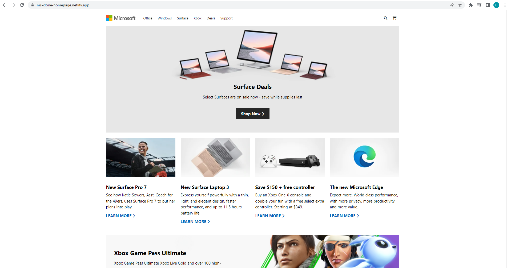

## Microsoft home page clone

This repo is about making a clone of the Home page Microsoft site

this is the link: [Ms-clone](https://ms-clone-homepage.netlify.app/ "the working demo link").

**ScreenShots**:

**Desktop**:

**Tablette**:

**mobile**:
